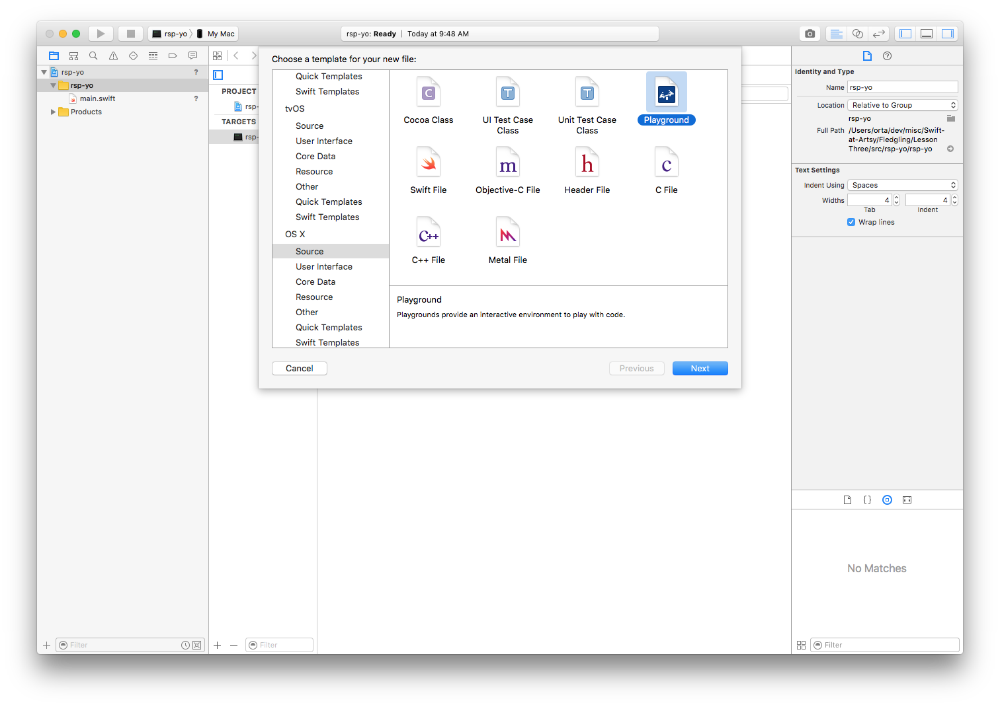

# Lesson Three 

Alright, we're back. 

I feel like I want to stay in the command-line for a little bit longer. Perhaps this plus one more lesson.

We're going to start with a game. It's one we all know, I hope. Rock, Paper, Scissors (RPS.) 

RPS should be a good game to work at with our prior knowledge, it's going to require some data modelling, some input handling and some game logic.

Let's start off by making a new Cocoa project in Xcode. The instructions for this is available in [Lesson Two](https://github.com/artsy/Swift-at-Artsy/tree/master/Fledgling/Lesson%20Two#xcode).

So, inside our new Xcode project, open `Main.swift`.  

### Scope

We're going to start with the data modelling. Let's consider, what things are we going to need to model?

* There are two players, you and the computer
* Each player chooses one of three options
* Once each player has made a choice, decide the winner
* Announce the winner

So, looking at those observations, how would you model the choices?

As this is a text document, I don't get the ability to hear you back, so I'm gonna assume you get the answer. This is a great case for an `enum` - it can only be one of three things. So, let's write an `enum`.

```swift
enum PlayerChoice {
    case Rock
    case Paper
    case Scissors
}
```

## Hello, World

Let's move on to creating our games title screen. This sets the scene for how good your game is. So, I searched for [ASCII art generator](https://duckduckgo.com/?q=ASCII+generator&t=osx&ia=web). I made this bad-ass logo.

```swift
print(" ")
print("____________________  _________                           ")
print("\\______   \\______   \\/   _____/            ___.__. ____   ")
print(" |       _/|     ___/\\_____  \\    ______  <   |  |/  _ \\  ")
print(" |    |   \\|    |    /        \\  /_____/   \\___  (  <_> ) ")
print(" |____|_  /|____|   /_______  /            / ____|\\____/  ")
print("        \\/                  \\/             \\/             ")
print(" ")
``` 

People will know I mean business now.

## You can go first

We can start with letting the computer choose their own value. To do this we're going to need to create a function that returns one of the three values that our enum `PlayerChoice` can be. We'll need to know how to generate a number, so I'll just tell you the best one (there's a few) and that is `arc4random` - of course!

I'd advise making a quick Playground in your project, go to the menu bar at the top, choose `File > New > File...`. Then in the popover, scroll down to `OS X` then choose a Playground:



Test out the random number generator by throwing in `arc4random()` a few times. It returns, well a lot of different numbers I got: `501225657`, `1897830877`, `1584874343`, `2199845807`, `3671598137` and `3468845996`. That's not really very useful for choosing a number between 1-3... So, let's use some programming magic. 

If we use `arc4random() % 3` we get numbers between 0-2, honestly, I don't really get how this works. Computers. Something about the result of a devision, it's called the [modulo operator](http://duckduckgo.com/?q=modulo+operator) if you want to dig deeper. 

So now we have a way of getting a random number, lets make a function that returns a random choice:

```swift
func randomChoice() -> PlayerChoice {
    switch arc4random() % 3 {
    case 1: return .Rock
    case 2: return .Paper
    default: return .Scissors
    }
}
```

Awesome. Call that a few times in your playground to verify all is good, then let's move on.

### Take your Turn

We need to save the random choice, we can do that with a `let`, I don't think we'll let the computer change their mind later. 

```swift
let computerChoice = randomChoice()
```

Now that they have made their choice, we need to let the player choose. If you recall last week, we went over user input. It looked like this:

```swift
print("Hello, World!")
print("> ", separator: "", terminator: "")

let response = readLine(stripNewline: true)
if let answer = response {
    print("You said: \(answer)");
}
```

This is a great place to work from. Let's change some of the wording:

```swift
print("What do you choose [R]ock, [P]aper, [S]issors?")
print("> ", separator: "", terminator: "")

let response = readLine(stripNewline: true)
if let answer = response {
    print("You said: \(answer)");
}
```

OK, now we need to do an if statement on the `answer`, we want to know whether the first 
letter is either a `r`, `p` or `s`. This is easiest to do if we take the answer, get the first character
then make it lowercase.

To get that, we get the `lowercaseString` version of our answer, then with ask for the first character
via `characters.first`. Giving us this:

```swift
if let answer = response {
    let choice = answer.lowercaseString.characters.first
    print("You said: \(choice)");
}
```

We've hit another problem though, `choice` is an optional. `You said: Optional("s")`. There is no guarantee that a string contains 
_any_ characters. So when we asked for the first one, we've gone into the space of "maybe there is, maybe there isn't".

This is just one of our problems. Let's think a bit further, what happens if someone doesn't include the right characters? 
IMO we should be harsh and make them tell us something correct. I think we might need a loop here. First though, maybe we should
move the user input side of this into a function  

```swift
func getPlayerChoice() -> PlayerChoice? {
    print("> ", separator: "", terminator: "")
    let response = readLine(stripNewline: true)
    if let answer = response {
        ...
    }
    return nil
}
```

This means if we get no response we return nil, lets do the same thing for the player choice:

```swift
func getPlayerChoice() -> PlayerChoice? {
    print("> ", separator: "", terminator: "")
    let response = readLine(stripNewline: true)
    if let answer = response {
        if let choice = answer.lowercaseString.characters.first {
            print("You said: \(choice)")
            ...
        }
    }
    return nil
}
```

Alright, now, one more thing, lets add our checks for the string we want:

```swift
func getPlayerChoice() -> PlayerChoice? {
    print("> ", separator: "", terminator: "")
    let response = readLine(stripNewline: true)
    if let answer = response {
        if let choice = answer.lowercaseString.characters.first {
            print("You said: \(choice)")
            if choice == "r" {
                return .Rock
            }
            if choice == "s" {
                return .Scissors
            }
            if choice == "p" {
                return .Paper
            }
            print("This is not a valid choice, please choose again.")
        }
    }
    return nil
}
```

This is the simplest implementation I can think of. We can make it more elegant at the end if we need to.

Now we can call this, and detect if it returns a choice.

```swift
var choice: PlayerChoice?
while choice == nil {
    choice = getPlayerChoice()
}

print(choice!)
```

We're using a new thing. A `while` loop. It's a scope where you have an if statement, and it will keep looping
while the statement next to the while is true. So this reads as _"while the choice variable is nil, set the 
choice to value from the playerChoice function"_. 

## Winners or Losers

Suddenly we've got to a point now where we have a computer choice, and a player choice! Awesome, the game is almost done.

We need to determine if you've won, we can do this by using some `||` (or) logic.

```swift
let youWon = choice! == .Rock && computerChoice == .Scissors ||
             choice! == .Scissors && computerChoice == .Paper ||
             choice! == .Paper && computerChoice == .Rock
```

and the same for the losing state:

```swift
let youLose = choice! == .Rock && computerChoice == .Paper ||
              choice! == .Scissors && computerChoice == .Rock ||
              choice! == .Paper && computerChoice == .Scissors
```

Then we can wrap it up with a little bow:

```swift
if youWon {
    print("You won!")
} else if youLose {
    print("You lost!")
} else {
    print("It's a draw!")
}
```