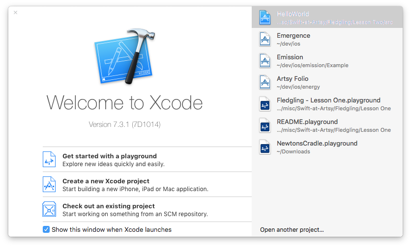
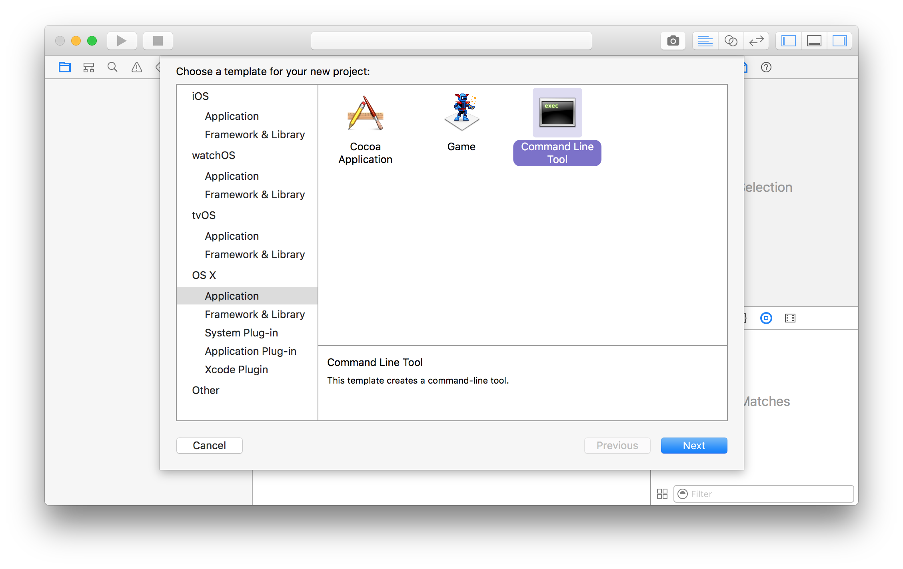
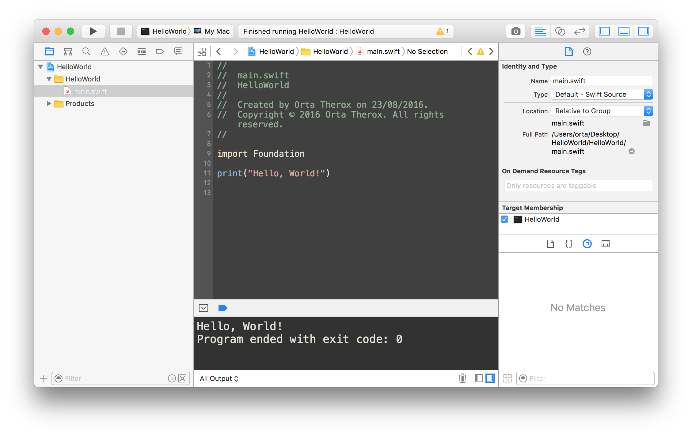

# Lesson Two 

We're going to make a command line application. From scratch. It's all going to come to 9 lines of code. This is code that I wrote without thinking "this is aimed at fledglings" - so there's quite a few concepts in here that are new to you. This means it's closer to production code, which ideally we want to be able to read/write as we are fledgling engineers. 

🐦

I think we can quite happily spend an hour just discussing those 9 lines. Here they are, for some foreshadowing. 

```swift
import Foundation

print("Hello, World!")
print("> ", separator: "", terminator: "")

let response = readLine(stripNewline: true)
if let answer = response {
    print("You said: \(answer)");
}
```

### Xcode

To get started we need to create a new project. Open up Xcode and you will be presented by this window.



Click on "Create a New Xcode Project" to choose the type of project. We want to make an `OS X` `Application`, that is a `Command Line Tool`.

 

Choosing this brings up a form, you can call it what you like, I'm calling mine "HelloWorld." The only other thing that is important here, is that you change the language to Swift. This isn't learn Objective-C at Artsy - 'ya know. 

This gives us a full Xcode project that creates an app that runs inside a terminal. To run it either click the play button in the top left, or press `cmd` + `r`. The output of `print` will show along the bottom.



### Import

OK, we've said ignore the `import` enough times. Let's dig into this. 

So, last time we talked a little bit about non-trivial Objects (this wasn't noted, we looked into the [NSDate](https://developer.apple.com/library/mac/documentation/Cocoa/Reference/Foundation/Classes/NSDate_Class/index.html) class) These objects are made up from the types that we've been playing with: `Int`s, `String`s, `Array`s, `Bool`s. 

We call the Types that are included inside Swift, the "Standard Library." These are the effectively building blocks of all other Types. However, it's hard to create an application with just numbers and strings. So, we bundle collections of related objects together into libraries or frameworks.

Apple provides a set of libraries for you to use, in this case, there is one called `Foundation`. `Foundation` provides `NSDate` for dates, `NSFileManager` for getting information in/out of the file system, `NSTask` for running command line tasks, `NSURL` for representing a URL and a lot more. These are all considered foundational tools. 

Separate from `Foundation` is `Cocoa` or `UIKit` - these provide all of the user interface objects, which we may touch on later in the week.

This is a perfect point to pitch what CocoaPods is. CocoaPods is a way of using other people' libraries. So, in the Artsy app we have code from Facebook, GitHub and many individual developers from around the world. We use the `import` statement to bring in their code into our apps, and CocoaPods is the glue that makes all that work.

This means we can work on the shoulders of others, and we give back, so others can work from our shoulders.  

### Optional Parameters

* Show how `print` can be both `print("Hello, World!")` and `print("> ", separator: "", terminator: "")`
* Cover how that allows you to have more expressive & succinct functions 

### Letting things be

* Talk about `let`
* Discuss the ideas of mutable vs immutable

### if let this = that

* Discuss optionals - think of an example that can be true/false and unknown.
* Cover this use case like this one:
  - What if you're running inside a place where you cannot use a keyboard?

### Running our app

* Talk about the idea of compilers, and build artifacts
* Open terminal
* Show how to run our app from the terminal

### Expanding out

* Make a simple calculator if there is time.
